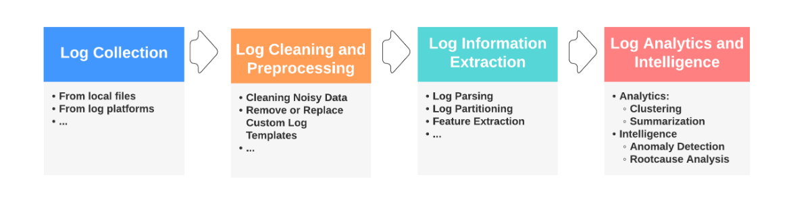
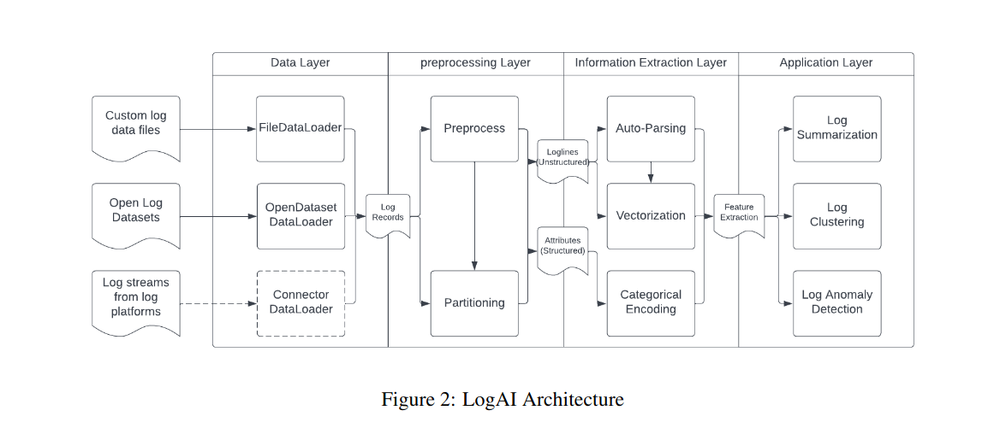
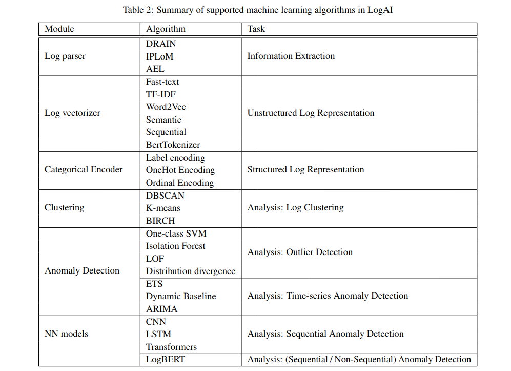

# LOGAI: A LIBRARY FOR LOG ANALYTICS AND INTELLIGENCE
- The volume of logs generated can be humongous (of the order of petabytes per day) especially for complex
distributed systems, such as cloud, search engine, social media, etc.
- 1PB = 1,024 TB --> 10,00,000 GB
- LogAI supports tasks such as log summarization, log clustering and log anomaly detection. 
- It adopts the OpenTelemetry data model, to enable compatibility with different log management platforms.
- GUI for users to conduct interactive analysis.
- LogAI portal is developed using Plotly Dash framework.
- Logs are widely used in a variety of operational tasks, covering use cases such as system
availability, reliability and security. 

#
- LogAI is also the first open source log analytics library that incorporate time-series algorithms, statistical learning algorithms and deep learning algorithms.
- LogAI also provides a unified data model, inheriting from OpenTelemetry log data
model, to handle logs in different formats.

     
# Design Principles
1. high compatibility with data from
different log sources
2. reusable components to avoid reproducing effort
3. unified setup process for customized
applications 
4. easy-to-use GUI for out-of-box interactive log analysis.

# Architecture

- In current version they implemented FileDataLoader to load data from local files [ex: .log,.csv,.tsv,.json ]
- In the future versions it will support data loaders with connectors to consume data directly
from log platforms such as Splunk, Datadog, AWS Cloudwatch, etc.
#
- Current log analysis research and applications indicate three main
input data types are used in the ML approaches: 
1. converting log records into counter vectors to use time-series ML
techniques, 
2. converting log records into feature vectors to use tabular-based ML techniques 
3. converting log
records into sequences to use sequential ML techniques.

- LogAI implemented four components in the information extraction layer to extract information from the log records
and convert logs to the target formats.

1. **Automated Log Parsing**
- LogAI covers
three automated log parsing algorithms: DRAIN, IPLoM and AEL.   
2. **Log Vectorization**
- is a class that converts unstructured loglines into semantic vectors.
- LogVectorizer supports popular text vectorization
algorithms such as TF-IDF, FastText, Word2Vec, etc.
3. **Categorical Encoding**
- is a class that encodes log attributes, the structured portion of logs.
- CategoricalEncoder supports popular
categorical encoding algorithms such as label encoding, one-hot encoding, ordinal encoding etc.
4. **Feature Extraction**
-  is a class that conducts final transformation of raw log data into log feature
set that machine learning models can consume.
- It cover three types of log features: 
1) time-series
counters (ETS, ARIMA)
2) semantic feature sets (Machine learning and deep learning
models)
3) sequence vectors (RNN,CNN)
#
**Anomaly Detection**
- LogAI supports two different types of anomaly detection: 
1) anomaly detection based on log counter vectors.
2) anomaly detection based on log semantic representations. 

- The supported anomaly detection algorithms includes
univariate and multivariate time-series analysis algorithms from Merlion, unsupervised outlier detection models
like one-class SVM and local outlier filter (LOF) from scikit-learn.
-  LogAI integrate some of
the popular **deep learning** based algorithms like recurrent neural network (RNN) based model LSTM, convolutional
neural network (CNN), Transformers and pretrained Transformer based Language Model BERT.   
- The output
are anomaly scores for each log sequence.
# ML MODELS

#
- The existing Loglizer library provides the more traditional machine learning
algorithms for log based anomaly detection, with the Deep-Loglizer being a deep-learning based counterpart of it,
providing only neural ML models.
- provides a generic framework encompassing most of the
popular AI/ML algorithms - starting from traditional statistical ML models to popular neural models and BERT.
# Unsupervised Anomaly detection !

| Paradigm       | Model(s)               | Key Principle             | Main Metric | Trained On       |
| -------------- | ---------------------- | ------------------------- | ----------- | ---------------- |
| Forecasting    | LSTM, CNN, Transformer | Predict next event ID     | F1 Score    | Only normal logs |
| Reconstruction | LogBERT                | Reconstruct masked tokens | AUROC  (Area under Receiver Operating Characteristic Curve)      | Only normal logs |

- ## **Forecasting-Based Models** (Predict Next Log Event)

    **How it works:** Train a model to predict the next log event (ID) based on the previous sequence.

    **Loss used:** Cross-entropy between predicted and actual event.

    **Assumption:** If the model predicts something far from the actual event, it might be an anomaly.

1.  **LSTM (DeepLog, LogAnomaly):**

    - Unidirectional or bidirectional.

    - Can use attention mechanism.
2. **CNN:** Applies convolution + pooling to encode the log sequence (used only in supervised settings before).
3. **Transformer (LogSy):** Uses self-attention; averages token embeddings to get a sequence representation.
- During inference,
If the true next event is not among top-k (e.g., top-10) predictions → mark as anomaly.

- ## **Reconstruction-Based Models** (Rebuild Input Logs)
- Try to reconstruct masked tokens from a log sequence. If reconstruction fails → possibly an anomaly.
- **Loss used:** Masked Language Modeling (MLM) loss.

- **Assumption:** Normal logs can be reconstructed well; anomalous ones cannot.

ex: **LogBERT**(from LanoBERT paper)

- Based on BERT transformer.

- Trains tokenizer from scratch on log data.

- No need for structured parsing.

- Inference uses sliding masking windows, computes average confidence → anomaly score.

    
